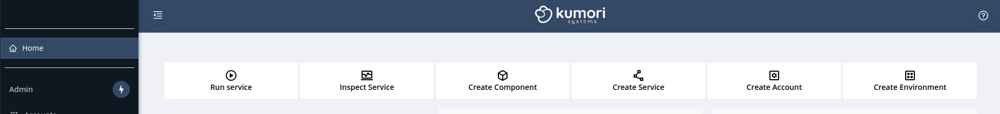
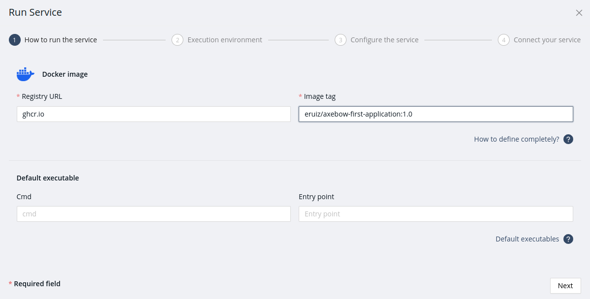
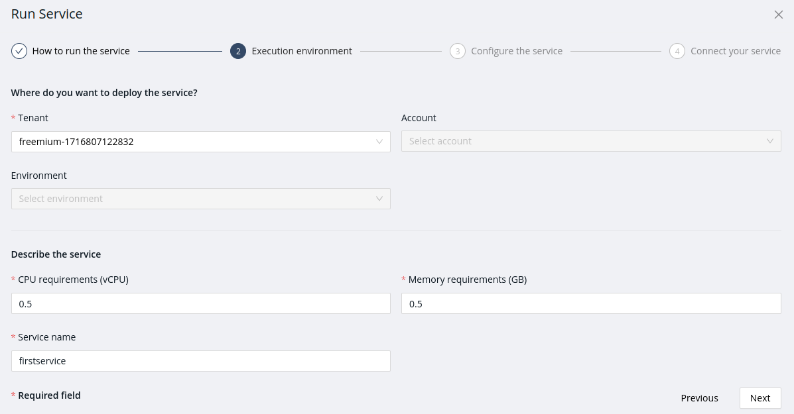
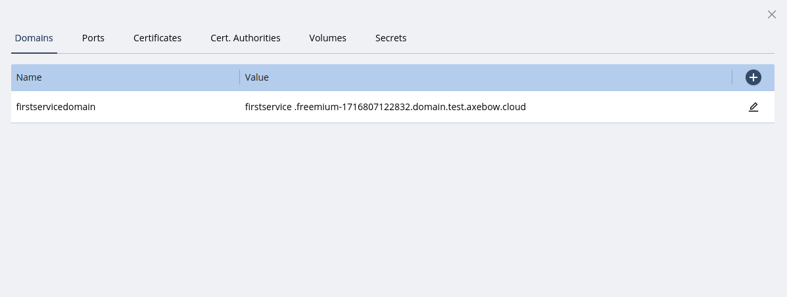
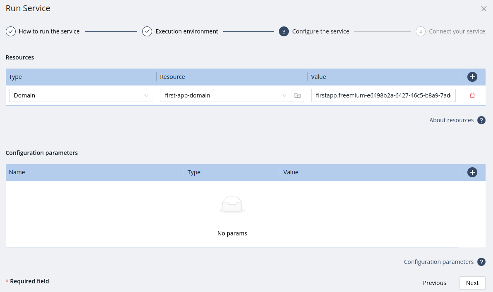
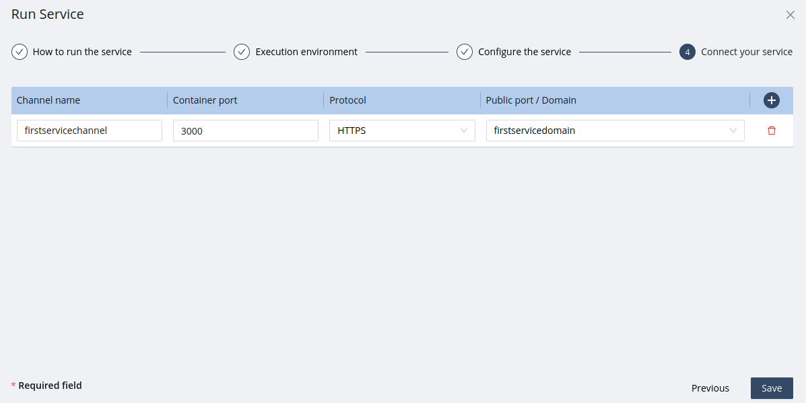
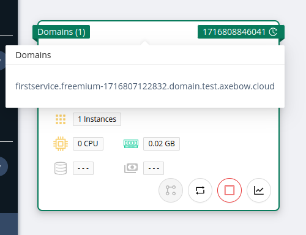

= Service web application for Axebow
:toc:

== Introduction

This project contains a Nestjs-Handlebars web application source code to learn how to deploy a service web application with Axebow, the easiest Platform Engineering to deploy cloud native services.

== How to deploy

A ready to use container image has been published at `ghcr.io/eruiz/axebow-first-service:1.0`, deploy it following steps below:

1. Sign in to the https://axebow.cloud/[Axebow web interface,role=external,window=_blank]
+
image::./doc/images/axebow-signin.png[Login,200]

2. In the Homepage, on top toolbar, press the _Run Service_ button.
+

3. In the first step _How to run the service_, set the required fields:
** The _Container registry URL_ in which you pushed the container image.
** The _Image tag_ with which you named the container image.
** For example, if you used GitHub Packages:
+

4. Second step, _Excecution environment_, set the required fields again:
** _Tenant_, choose the _freemium_ tenant which allow to deploy services at no cost.
+
[IMPORTANT]
====
The _freemium_ tenant is *limited to 2 vCPUs and 4 GB of memory* for each user. Moreover, the resources and deployed services are cleaned each 2 hours. https://link-to-how-to-create-accounts-guide[Create your own Accounts] and https://link-to-how-to-create-environments-guide[Environments] to overpass these limits.
====
+
** _CPU requirements_, set 0.5
** _Memory requirements_, set 0.5
** _Service name_, the service unique identifier.
** For example, if you used GitHub Packages:
+

5. Third step, _Configure the service_, set the domain resource that will allow to send requests to the service web application from Internet.
+
[IMPORTANT]
====
At the date of writing this guide, only `axebow.cloud` subdomains are supported.

To create a new domain, just press on manage resources button and write the subdomain name, Axebow will generate the domain.

====
+
Example:
+

+
The service web application doesn't need to receive configuration injected via environment variables, so you let the Configuration parameters table empty.

6. Last step, _Connect your service_, create a public port, accesible from the Internet and link it to the port the container listens and the service web application attends the HTTPS requests.
** _Channel name_, the communication channel unique identifier.
** _Container port_, the exposed port.
+
[TIP]
====
You can get info about the container exposed ports in the Dockerfile. If you open the Dockerfile you'll see the container listens on port 3000.

`EXPOSE 3000`
====
** _Protocol_, select HTTPS because the service is a web application.
** _Public port / Domain_, select the domain created in the step 3.
** Example:
+

7. Finally run the service web application by pressing the button _Save_

Navigate to the Runtime Dashboard and you'll see the serice web application running. Click on Domains list and press on the domain URL to navigate to the web application.

== Build your own container image

Follow this steps to build and publish your own container image:

1. Clone this repository to your local computer.
+
[source]
----
git clone https://github.com/eruiz/axebow-first-service.git
----

2. Build the service web application and create the container image. By using a multistage build, both the application and the container image are build in only one step.
+
Tag the container image using the name and optionally a tag you will use to publish in the container registry.
+
[source]
----
# Build command pattern: docker build -t $REGISTRY/$REPOSITORY:$IMAGE_TAG .
#
# Example: Build to publish in GitHub Packages.

docker build -t ghcr.io/[NAMESPACE]/axebow-first-service:1.0 .
----
+
Replace `[NAMESPACE]` with the name of the personal account or organization to which you want the package to be scoped.

3. Publish the container image to the Container registry.
+
[source]
----
# Authenticate to the Container registry.
# 
# Example: If you use GitHub Packages, use a personal access token

echo [GITHUB_TOKEN] | docker login ghcr.io -u [USERNAME] --password-stdin

# Example: Push the container image to the Container registry

docker push ghcr.io/[NAMESPACE]/axebow-first-service:1.0
----
+
Replace `[GITHUB_TOKEN]` with your personal token. Note, `the GITHUB_TOKEN` must be granted with: _repo_, _write:packages_, _read:packages_ and _delete:packages_ permissions.

